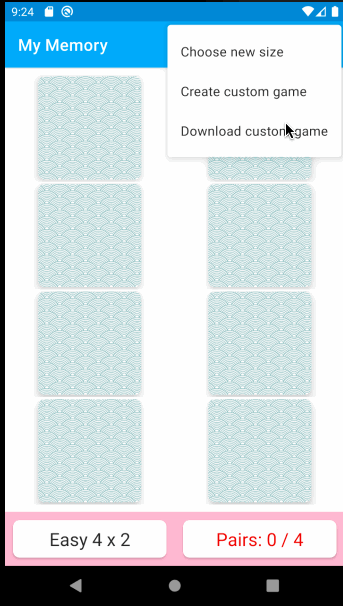

# *My Memory Builder app*

**MyMemory** is a memory-builder Android mobile game. 

### User Stories

- User can play a default game by flipping over cards and matching pairs 

- User can switch between different board sizes to increase game difficulty

- User create their custom game by uploading images

- User can download any custom games others have made (stored on Firebase) 

- User can browse all games that others have made, including their levels of difficulty and average moves made

### Notes

This app is made through a series of instructional videos made by [Rahul Pandey](https://www.youtube.com/user/rpandey1234). Here is the original code's [Github](https://github.com/rpandey1234/MyMemory).

Uses Firebase for cloud storage. 

### Attributions 

- GIF created with [LiceCap](http://www.cockos.com/licecap/)
- Wave image used for card background and app icon [Attribution-ShareAlike 4.0 International (CC BY-SA 4.0)](https://creativecommons.org/licenses/by-sa/4.0/)
- [Picasso](https://github.com/square/picasso)
- [Confetti](https://github.com/jinatonic/confetti)

